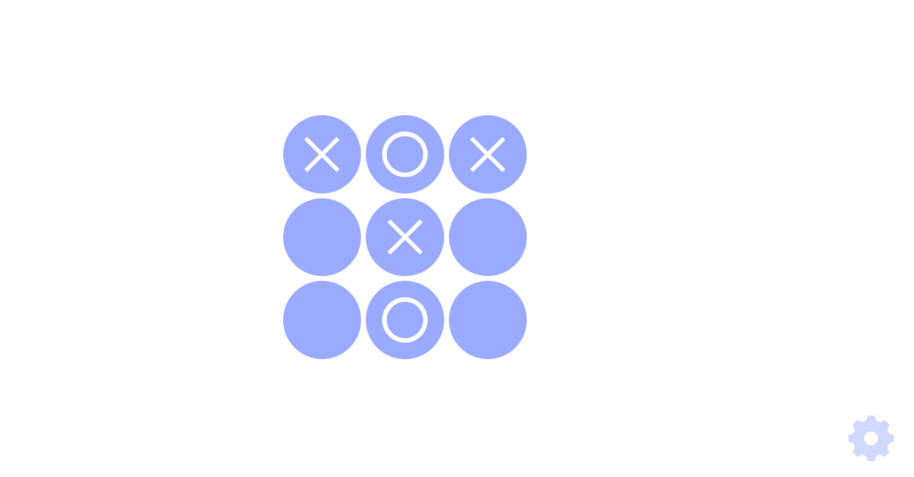

# Tic-Tac-Toe with React.js

### Tic-Tac-Toe game created using React.js

Tic-tac-toe game with clean, minimalistic UI and 3 difficulty levels of AI. It also remembers last chosen AI level.

### AI

There 3 AI levels:
* `EASY` - Simple random moves;
* `MEDIUM` - Random moves with rule based conditions for winning and not losing;
* `HARD` - Minimax algorithm with alpha-beta pruning.

### UI

